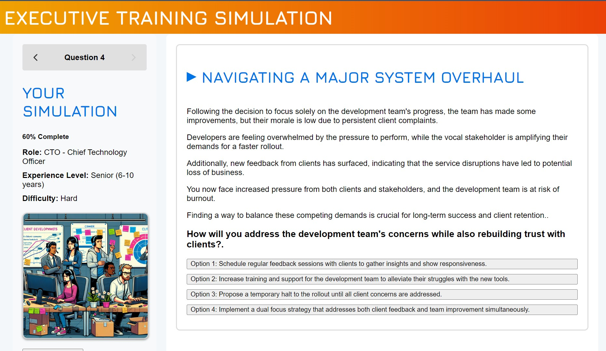

# ExecuTrainSimulator  

ExecuTrainSimulator is a React application designed to provide dynamic training simulations for executives. The app leverages AI to generate scenarios that users can solve through a series of multiple-choice questions, leading to varying consequences and outcomes.  
  
## Table of Contents  
  
- [Installation](#installation)  
- [Dependencies](#dependencies)  
- [Running the Application](#running-the-application)  
- [Project Structure](#project-structure)  
- [Contributing](#contributing)  
- [License](#license)  
  
## Installation  
  
To get started with ExecuTrainSimulator, follow these steps:  
  
1. **Clone the Repository:**  
  
   git clone https://github.com/brothercast/ExecuTrainSim.git
 
2. Navigate to the Project Directory:

cd ExecuTrainSimulator  
 

### Dependencies
 
Ensure you have the following installed on your machine:

- **Node.js**: Download and install from Node.js official site.
- **npm**: Comes bundled with Node.js, but ensure it's up-to-date by running:

    npm install -g npm  
 
3. Install Project Dependencies:

Navigate to the executrainsim directory and install the client dependencies:

cd executrainsim  
npm install  

Then, navigate to the executrainserver directory and install the server dependencies:

cd ../executrainserver  
npm install  
 
## Running the Application
 
To start the application, you will need to run both the client and server.

Start the Server:

Navigate to the executrainserver directory and run:

node server.js  
 
2. Start the Client:

Open a new terminal, navigate to the executrainsim directory, and run:

npm start  
 
The client will typically be available at http://localhost:3000, and the server will listen on port 5000.

## Usage Examples
 

1. **Select Your Role:**

Choose from various executive roles, such as CEO, CFO, CMO, or customize your own role.

2. **Set Experience Level and Difficulty:**

Tailor the simulation to your experience level and desired difficulty.

3. **Engage with Scenarios:**

Navigate through dynamically generated scenarios, making decisions that impact the outcome.

4 **Receive Feedback:**

Get immediate feedback on your choices and see how they influence the scenario.

5 **Debriefing:**

At the end of the simulation, receive a detailed debriefing with strengths, areas for improvement, and recommendations.

## Project Structure
 
**executrainsim**: Contains the React front-end application.
**executrainserver**: Contains the server-side logic and API endpoints.

### License
 
ExecuTrainSimulator is licensed under the MIT License. See LICENSE for more information.

  
### Key Sections:  
  
- **Installation:** Step-by-step instructions for setting up the project.  
- **Dependencies:** Details on required installations.  
- **Running the Application:** Instructions on how to start the server and client.  
- **Project Structure:** Overview of the folder structure.  
- **Contributing and License:** Basic guidelines and licensing information.  